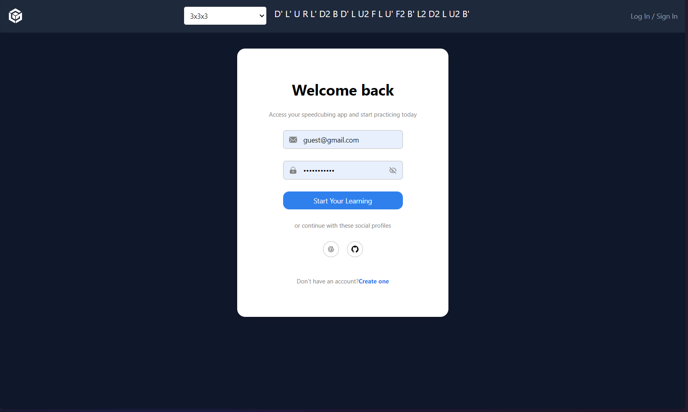
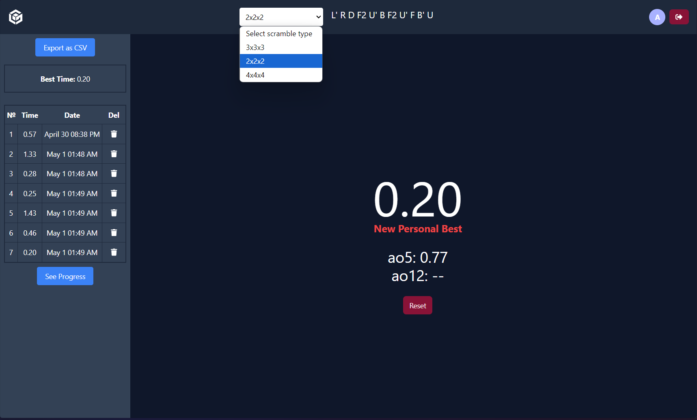
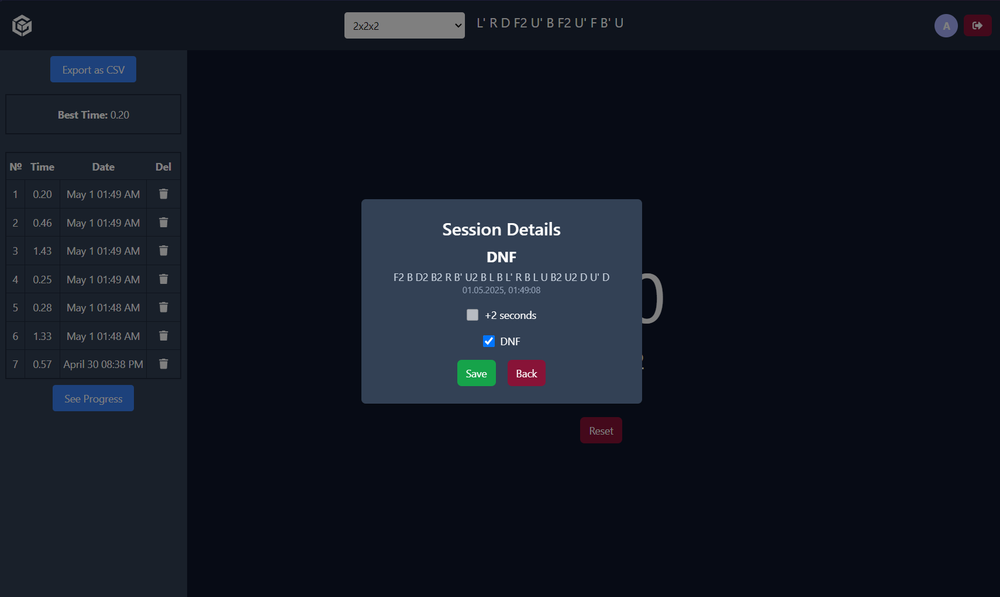
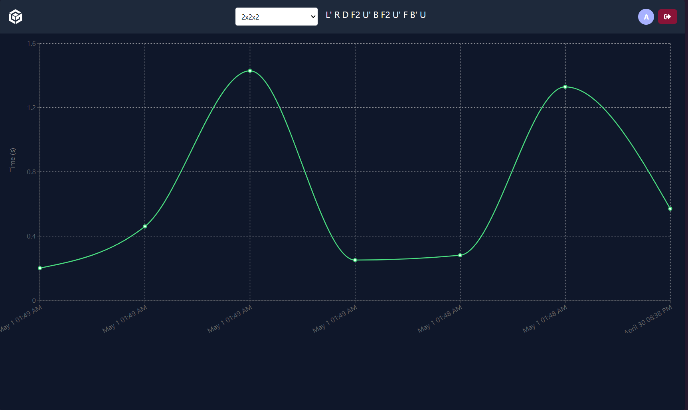

<h1 align="center" id="title">CS Timer</h1>

<p align="center"></p>

<p id="description">This is a user-friendly and simple version of a <a href="https://cstimer.net/">popular speecubing timer</a></p>

<h2>🧐 Features</h2>

Here're some of the project's best features:

- Auth
- Sessions & Details
- Timer
- Sessions Graph
- Export sessions in CSV
- Different puzzle types (e.g. 3x3, 2x2 etc)

<h2>🛠️ Installation Steps:</h2>

<p>1. Clone the project</p>

```
git clone https://github.com/oiibar/CS_Timer.git
```

<p>2. Navigate to the client folder</p>

```
cd CS_Timer/client
```

<p>3. Install client-side packages</p>

```
npm i
```

<p>4. Run the client</p>

```
npm run dev
```

<p>5. Navigate to the server folder</p>

```
cd CS_Timer/server
```

<p>6. Install server-side packages</p>

```
npm i
```

<p>7. Run the server</p>

```
npm run start:dev
```

<h2>💻 Built with</h2>

Technologies used in the project:

- ReactJS
- NestJS
- TypeScript
- PostgreSQL
- RESTful API
- Redux Toolkit
- ReCharts

Here are some screenshots of the project:

<p align="center">
  
  
  
  
</p>

<h2>💖Like my work?</h2>

Feel free to contact me<p><a href="contact-me-neon.vercel.app">contact-me-neon.vercel.app</a></p>
